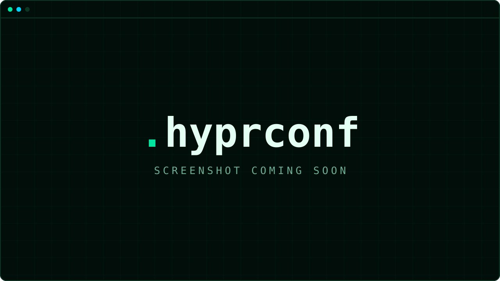

<p align="center">
  
</p>

<p align="center">
  <a href="https://hyprconf.sh"></a>
  
  
  <a href="https://omarchy.org"></a>
</p>

<p align="center">
  
</p>

<p align="center"><sub>A desktop capture is coming; the placeholder holds its place.</sub></p>

# .hyprconf

**hyprconf** is an overlay for [Omarchy](https://omarchy.org): a lean deployment
mechanism — one idempotent `install.sh` plus the files it ships — that ports the
hyprconf configuration suite's functionality onto a stock Omarchy install.
Omarchy owns the base system (packages, session, shell, theme engine, lock/idle,
bar); hyprconf layers one person's preferences on top, always through Omarchy's
own tools and documented seams:

| Layer | What you get |
|---|---|
| Hotkeys | hyprconf's keymap in `~/.config/hypr/bindings.lua`, with descriptions so it shows in Omarchy's `SUPER+K` menu |
| Look'n'feel + input | Tighter gaps, hairline rounding, blur/shadow, fade workspace animation, natural scroll, 3-finger swipe; Steam tiles like every other window |
| Monitor presets | `bedroom` / `kitchen` / `K` / `pc` / `laptop`, hot-swapped with a hotkey (`switch_monitor.sh`) |
| Bar widgets | A clock that ticks seconds, active-only workspaces on two lines with a Pac-Man on the focused one, the focused window's title, a CPU/temp/mem/GPU/net readout — all as Omarchy shell plugins |
| Terminal + shell | kitty as the default terminal, running zsh + Oh My Zsh + Powerlevel10k *inside* the terminal; the login shell stays bash |
| Greeting | hyprconf's `fastfetch` layout |
| Theme reach | Every `omarchy theme set` also lands in Firefox and Code - OSS, which Omarchy's own fan-out misses |
| Privacy | A system Firefox policy: telemetry off, tracking protection on, uBlock Origin force-installed — plus UI defaults (vertical tabs, the revamped sidebar, compact mode available, `userChrome.css` loading on, the new tab's sponsored tiles, stories and weather off) |
| YubiKey | `hyprconf-yubikey`: unlock the LUKS root at boot with a FIDO2 key (Omarchy's own `omarchy-setup-security-fido2` covers sudo/polkit) |
| VPN | **Proton VPN** in Omarchy's menu — Install → Service, beside NordVPN — installed from Arch's official repos with `omarchy-pkg-add` |

---

## Requirements

- A running [Omarchy](https://omarchy.org) install. Verified against Omarchy 4.0.0 (Hyprland 0.56, Lua config — hyprlang `.conf` is gone). `install.sh` refuses to run when `/usr/share/omarchy` or `omarchy-pkg-add` is missing.
- `git`, and a terminal for the two stages that need `sudo` (packages, Firefox policy).

## Install

```bash
bash <(curl -fsSL hyprconf.sh)
```

`hyprconf.sh` serves `install.sh` itself to curl. Run with no payload beside it, it refuses a box without Omarchy before touching anything, clones the `stable` branch into `~/.hyprconf` — or uses the checkout already there, without pulling it — and hands over to that checkout's `install.sh` with the same options. `HYPRCONF_REPO` (`https://github.com/ak4dev/.hyprconf`), `HYPRCONF_BRANCH` (`stable`) and `HYPRCONF_DIR` (`~/.hyprconf`) override those three. The same by hand:

```bash
git clone -b stable https://github.com/ak4dev/.hyprconf ~/.hyprconf
bash ~/.hyprconf/install.sh
```

`stable` is the branch users get; `omarchy` is the working branch until `scripts/publish` promotes it. On a terminal every run opens with the `.hyprconf` ASCII banner (the art of `assets/banner.svg`, naming the branch); the post-update hook's run inside `omarchy-update` stays quiet — that run has a pty (`omarchy-update` re-execs under `script(1)`), so the gate is the `OMARCHY_UPDATE_LOGGED` marker it exports, not the tty test.

| Flag | Effect |
|---|---|
| *(none)* | Apply every stage once. Idempotent — re-running is how you pick up changes. |
| `--sync` | `git pull --ff-only` the checkout, re-apply, then run `omarchy-update`. This is what the `hyprsync` alias runs. |
| `--no-update` | Apply only; never invoke `omarchy-update`. Used by the post-update hook, which already runs inside an update. |
| `--no-packages` | Skip the two stages that need `sudo`: packages and the Firefox policy. The hook passes this too. |
| `-h`, `--help` | Usage: both forms and the three variables. On the curl path it answers from the served copy — nothing is cloned. |

### What each stage does

| Stage | Changes | Mechanism |
|---|---|---|
| packages | Installs the `packages` list (official repos only) | `omarchy-pkg-add` — idempotent, never bare `pacman -Syu` (Omarchy's ALPM hook blocks it) |
| firefox | `/etc/firefox/policies/policies.json` from `infra/firefox/policies.json` (privacy locks + UI defaults, see the Privacy row) | `sudo install`; skipped when there is no terminal for the password prompt. The overlay's one write outside `$HOME` |
| terminal | kitty becomes the default terminal; `~/.config/kitty/hyprconf.conf` (cursor trail, 0.85 opacity, `shell <zsh>`) plus one `include hyprconf.conf` line appended to `kitty.conf` | `omarchy-default-terminal kitty`; Omarchy's `kitty.conf` stays authoritative (theme include, `listen_on`, font lines). The setter's exit status is its closing notification's, so with no shell (a TTY first run) it warns and the re-run finds kitty already current |
| theme | `~/.config/omarchy/themes/dracula` → `themes/dracula` (hyprconf's Dracula palette + wallpaper) | Symlinked user theme, **installed, never activated** — pick it with `omarchy theme set dracula` or `SUPER+SHIFT+CTRL+SPACE`. A real `themes/dracula` directory (a theme you installed yourself) is left alone with a warning |
| defaults | Browser `firefox`, editor `code` — **set once** | `omarchy-default-browser` / `omarchy-default-editor`; marker `~/.local/state/hyprconf/defaults-applied` |
| backgrounds | `wallpapers/gruvbox.jpg` → `~/.config/omarchy/backgrounds/gruvbox/` | Copied when absent (Omarchy's picker only scans the active theme's dirs) |
| font | System monospace → GeistMono Nerd Font — **set once** | `omarchy-font-set`; marker `~/.local/state/hyprconf/font-applied` |
| idle | Screensaver after **15 min** (`idle.screensaver = 900` in `~/.config/omarchy/shell.json`; Omarchy's default is 150 s; the lock timeout is left alone) — **set once** | Omarchy 4.0.0-1 has no command for these keys, so `jq` edits the file the way `omarchy-shell-config`'s `commit` does (seeded from Omarchy's shipped defaults when you have no `shell.json` yet), then `omarchy-shell shell reloadConfig`; marker `idle-applied` |
| hotkeys | `~/.config/hypr/bindings.lua` → `hypr/bindings.lua`; `switch_monitor.sh` + `adjust-gaps` → `~/.config/hypr/scripts/` | Symlink (stock file backed up to `bindings.lua.stock`) |
| looknfeel | `~/.config/hypr/looknfeel.lua` and `input.lua` → the repo's | Symlinks (`.stock` backups) |
| monitors | Seeds the five presets into `~/.config/hypr/`; saves Omarchy's `monitors.lua` to `monitors.lua.stock` once | Seeded, never overwritten — a preset is machine-local; delete one to re-seed. The active `monitors.lua` is untouched until a hotkey is pressed |
| fastfetch | `~/.config/fastfetch/config.jsonc` → `fastfetch/config.jsonc` | Symlink |
| bin | Every `bin/hyprconf-*` tool → `~/.local/bin/`: `hyprconf-stats`, `hyprconf-gpu-info` (bar-widget feeders), `hyprconf-yubikey`, `hyprconf-firefox-theme`, `hyprconf-install-service-protonvpn` | Copied, with `@HYPRCONF_DIR@` substituted for the checkout path |
| menu | A **Proton VPN** row in Omarchy's menu, Install → Service, beside NordVPN — hidden once `proton-vpn-gtk-app` is installed (below) | A managed block (`// >>> hyprconf >>>` … `// <<< hyprconf <<<`) before the closing brace of `~/.config/omarchy/extensions/omarchy-menu.jsonc`, Omarchy's own menu extension file: seeded from its template when absent, written through a symlink, rewritten only when the bytes differ. A file with no closing-brace line is left alone with a warning |
| bar_plugin | `hyprconf.resources` widget in the bar's right section | `plugins/hyprconf-resources/` synced into `~/.config/omarchy/plugins/` on every run; enabled **once** |
| clock | `hyprconf.clock`: a copy of `omarchy.clock` patched to tick seconds, format `hh:mm:ss AP` — **set once** | Same copy mechanics as `omarchy plugin clone` (project namespace instead of `<username>.`); `omarchy-bar set`; the bar's `centerAnchor` follows only if it still pointed at `omarchy.clock` |
| workspaces | `hyprconf.workspaces`: the overlay's own workspaces widget — only workspaces that exist, on two lines, Pac-Man on the focused one | `plugins/hyprconf-workspaces/` synced on every run (a `clonedFrom` copy the shell swaps into the stock widget's slot); enabled **once** |
| window_title | `hyprconf.active-window`: the focused window's title after the workspaces, on **two lines** | `plugins/hyprconf-active-window/` synced on every run (a `clonedFrom` copy the shell swaps into the stock `omarchy.active-window` slot); enabled **once** with no placement of its own: the manifest's `defaultSection: left` and the shell's own anchor after `omarchy.workspaces` — resolved to the `hyprconf.workspaces` copy while it is on the bar — place it |
| shell | Oh My Zsh + Powerlevel10k cloned into `~/.oh-my-zsh`; `~/.p10k.zsh` → `zsh/.p10k.zsh`; managed block in `~/.zshrc` | Plain `git clone`, no `chsh` |
| hooks | `~/.config/omarchy/hooks/post-update.d/10-hyprconf` and `theme-set.d/10-hyprconf` | The first re-runs `install.sh --no-update --no-packages` after every `omarchy-update`; the second extends every `omarchy theme set` to Firefox and Code - OSS (below) |
| theme_apps | Firefox `userChrome.css`/`user.js` and Code - OSS settings match the **active** theme right away | Runs the theme-set hook once for `~/.local/state/omarchy/current/theme.name`; a no-op with no active theme |
| *(end)* | One `omarchy-restart-shell` when a widget's files were synced or the clock copy was made this run (never more than one, whatever the number of widgets); `hyprctl reload`; with `--sync`, `omarchy-update` | The shell restart is skipped when nothing changed and tolerated failing (no shell on a TTY) |

### What it deliberately leaves alone

- The **login shell** — no `chsh`. zsh runs inside kitty only; `~/.zshrc` sources Omarchy's own `envs`/`aliases`, so its updates flow through.
- The body of `~/.config/kitty/kitty.conf`, `~/.bashrc`, `/usr/share/omarchy`, and everything under `/etc` except the Firefox policy (and, only when you run it, what `hyprconf-yubikey enroll` changes — see below).
- The **active theme**, the **active `monitors.lua`**, and every set-once choice (font, default apps, idle, clock, widget enables) after the first run — change them with Omarchy's own commands and hyprconf will not take them back.
- Omarchy's keyboard layout logic in `input.lua`, and its volume / brightness / media keys, `SUPER+K` (keybindings menu), `SUPER+3`/`4`.

## Sync

```bash
hyprsync            # the checkout's install.sh --sync (found through the ~/.p10k.zsh link, so a relocated checkout works)
bash install.sh     # after any `omarchy refresh` or when you just want to re-apply
```

- **After `omarchy-update`** the post-update hook re-applies the overlay automatically (a migration replaces `bindings.lua` when it hash-matches stock; `omarchy refresh config kitty/kitty.conf` drops the `include` line).
- **`omarchy refresh config hypr/<file>` / `omarchy refresh hyprland` write *through* the symlinks** into the checkout (`cp -f` follows links — observed on Omarchy 4.0.0). `install.sh` detects a `hypr/*.lua` that is byte-identical to Omarchy's stock template and restores it with `git checkout`; a monitor preset reset to the stock `monitors.lua` template is reported, with the pointer to Omarchy's own `monitors.lua.bak.<epoch>` backup of your edits.
- **Edit workflow:** the files in `~/.hyprconf/hypr/` *are* the live files — edit them there, then `bash install.sh` (or `hyprsync`) after a pull or a refresh.

## Repository layout

The tree is in [`docs/CONTRIBUTING.md`](docs/CONTRIBUTING.md). What reaches your machine: `hypr/`, `bin/`, `plugins/`, `themes/`, `wallpapers/`, `zsh/`, `kitty/`, `fastfetch/` and `hooks/` land in `$HOME` (the `hypr/*.lua` overrides, the theme, `.p10k.zsh` and the fastfetch config as symlinks into the checkout; `lib/hyprconf/` is used in place), and `infra/firefox/policies.json` is the one system file.

## Monitor presets

| Preset | File | Hotkey |
|---|---|---|
| `bedroom` | `~/.config/hypr/pcMonitors.bedroom.lua` | `SUPER+SHIFT+B` |
| `kitchen` | `~/.config/hypr/pcMonitors.kitchen.lua` | `SUPER+SHIFT+K` |
| `K` | `~/.config/hypr/pcMonitors.K.lua` | — |
| `pc` | `~/.config/hypr/pcMonitors.lua` | — |
| `laptop` | `~/.config/hypr/laptopMonitors.lua` | — |
| `stock` (or `omarchy`) | `~/.config/hypr/monitors.lua.stock` | — |

```bash
~/.config/hypr/scripts/switch_monitor.sh <preset>
```

`switch_monitor.sh` snapshots the live `monitors.lua` to `monitors.lua.stock`, symlinks the preset over `monitors.lua`, runs `hyprctl reload`, then walks the preset's `hl.workspace_rule` lines and moves each existing workspace to its monitor (a reload only places *future* workspaces). Dark outputs get a `dpms` wake retry. Feedback goes through `omarchy-osd` and `omarchy-notification-send`. `stock` restores Omarchy's own layout as a real file. Each preset carries its workspace-to-monitor rules, and edits to a preset survive re-selecting it. Presets are Lua only: a pre-migration hyprlang `pcMonitors.<name>` is refused (linked over `monitors.lua` it would be a parse error that stops every later `require` in Omarchy's `hyprland.lua`).

## Bar widgets

| Plugin id | What | Revert |
|---|---|---|
| `hyprconf.clock` | Copy of `omarchy.clock` sampling at `SystemClock.Seconds`, format `hh:mm:ss AP` | `omarchy plugin disable hyprconf.clock` |
| `hyprconf.workspaces` | The overlay's own workspaces widget: only workspaces that exist (no fixed 1–5 pills, no id cap), stacked on two lines like the resources widget, hyprconf's Pac-Man (`󰮯`) on the focused workspace; click focuses | `omarchy plugin disable hyprconf.workspaces` |
| `hyprconf.resources` | Two aligned lines fed by `hyprconf-stats` and `hyprconf-gpu-info` (long-lived JSON streams): top **CPU temp / util · RAM · ↑ upload**, bottom **GPU temp / util · VRAM · ↓ download**. Columns are fixed-width (sized from their widest value) with a hairline gap between them, so nothing shifts as the numbers change. On a multi-GPU box the **active** card is shown — the one with the most VRAM in use (ties: utilization, then index), re-evaluated every sample. Click opens `btop` via `omarchy-launch-or-focus-tui` | `omarchy plugin disable hyprconf.resources` |
| `hyprconf.active-window` | The focused window's title after the workspaces, the way hyprconf's bar drew it — the overlay's own two-line version of Omarchy's `omarchy.active-window` (a `clonedFrom` copy, so it takes the stock slot) that lays the same character budget (`maxWidth`, 280 px of body text by default) out on **two caption-size lines**, so it takes about half the width; hover for the full title, click focuses, middle-click closes; budget via `omarchy bar set hyprconf.active-window maxWidth 400` | `omarchy plugin disable hyprconf.active-window` |

The clock copy is set once, and every widget is *enabled* once — disabling any of them sticks. The three plugins the overlay ships (`plugins/hyprconf-resources`, `plugins/hyprconf-workspaces`, `plugins/hyprconf-active-window`) are re-synced on every run, so a `git pull` updates them; the clock is the one copy of a stock plugin `install.sh` makes. `omarchy bar set hyprconf.clock format 'HH:mm'` reformats the clock.

## Keybindings

`mainMod` is `SUPER`. Everything below is bound with `o.bind` (Omarchy's helper, which records the description for `SUPER+K`); keys hyprconf takes over are unbound first, including Omarchy's keycode-form binds (`code:10…21`), so only one binding fires. The keymap is `hypr/bindings.lua` — edit it there, one bind per line.

### Applications

| Key | Action |
|---|---|
| `SUPER+T` | Terminal (`omarchy-launch-terminal` — follows `omarchy default terminal`) |
| `SUPER+F` | Browser (`omarchy-launch-browser`) |
| `SUPER+C` | Editor (`omarchy-launch-editor`) |
| `SUPER+E` | File manager (`omarchy-launch-nautilus`) |
| `SUPER+D` | Omarchy menu (`omarchy-menu toggle`) — Omarchy's own menu key is `SUPER+SPACE`, which stays |

### Windows

| Key | Action |
|---|---|
| `SUPER+Q` | Close window |
| `SUPER+SHIFT+Q` | Log out (`omarchy-system-logout`) |
| `SUPER+V` / `SUPER+SHIFT+SPACE` | Toggle window floating |
| `SUPER+P` | Pseudo window |
| `SUPER+SHIFT+F` | Full screen |
| `SUPER+← → ↑ ↓` | Focus left / right / above / below |
| `SUPER+SHIFT+← → ↑ ↓` | Shrink/expand window (repeating) |
| `SUPER+SHIFT+A / D / W / S` | Swap window left / right / up / down |
| `SUPER+SHIFT+=` / `SUPER+SHIFT+-` | Increase / decrease window gaps (`adjust-gaps`) |
| `SUPER+LMB drag` / `SUPER+RMB drag` | Move / resize window |

### Workspaces

| Key | Action |
|---|---|
| `SUPER+1, 2, 5–0` | Switch to workspace 1, 2, 5–10 |
| `SUPER+F1` / `SUPER+F2` | Switch to workspace 3 / 4 |
| `SUPER+SHIFT+1, 2, 5–0` | Move window to workspace 1, 2, 5–10 |
| `SUPER+SHIFT+F1` / `SUPER+SHIFT+F2` | Move window to workspace 3 / 4 |
| `SUPER+3` / `SUPER+4` | Left to Omarchy (workspace 3 / 4) |
| `SUPER+M` / `SUPER+SHIFT+M` | Toggle magic scratchpad / move window to it |
| `SUPER+scroll` | Scroll workspace forward / backward |

### System

| Key | Action |
|---|---|
| `SUPER+L` / `SUPER+SHIFT+Escape` | Lock system (`omarchy-system-lock`) |
| `SUPER+SHIFT+4` | Screenshot region (`omarchy-capture-screenshot region`) |
| `SUPER+SHIFT+V` | Clipboard history (`omarchy-menu-clipboard`) |
| `SUPER+SHIFT+BACKSPACE` | Toggle laptop display (`omarchy-hyprland-monitor-internal toggle`) |
| `SUPER+SHIFT+B` / `SUPER+SHIFT+K` | Monitor preset bedroom / kitchen |

**Left to Omarchy on purpose:** volume, brightness and media keys (Omarchy's drive its OSD and media service), `SUPER+K`, `SUPER+SPACE`, `SUPER+3`/`4`. **Displaced Omarchy defaults** (Omarchy 4.0.0-1, `/usr/share/omarchy/default/hypr/bindings/*.lua`; each still reachable by command or by another Omarchy key):

| Key | Omarchy's binding | Still available as |
|---|---|---|
| `SUPER+T` | Toggle window floating | hyprconf's `SUPER+V` |
| `SUPER+F` | Full screen | hyprconf's `SUPER+SHIFT+F` |
| `SUPER+C` / `SUPER+V` | Universal copy / paste | `CTRL+C` / `CTRL+V` in the app |
| `SUPER+SHIFT+F` | File manager (`omarchy-launch-nautilus`) | hyprconf's `SUPER+E`; Omarchy's `SUPER+ALT+SHIFT+F` (cwd) |
| `SUPER+SHIFT+B` | Browser (`omarchy-launch-browser`) | hyprconf's `SUPER+F`; Omarchy's `SUPER+SHIFT+RETURN` |
| `SUPER+SHIFT+← → ↑ ↓` | Swap window | hyprconf's `SUPER+SHIFT+A / D / W / S` |
| `SUPER+SHIFT+-` / `SUPER+SHIFT+=` | Shrink window up / expand window down (keycode binds `code:20`/`code:21`) | Omarchy's `SUPER+SHIFT+ALT+-`/`=` (a little) and `SUPER+CTRL+SHIFT+-`/`=` (a lot) |
| `SUPER+SHIFT+4` | Move window to workspace 4 (`SUPER+SHIFT+code:13`) | hyprconf's `SUPER+SHIFT+F2` |
| `SUPER+SHIFT+SPACE` | Toggle top bar | `omarchy toggle bar` |
| `SUPER+L` | Toggle workspace layout | `omarchy-hyprland-workspace-layout-toggle`; lock stays on Omarchy's `SUPER+CTRL+L` too |
| `SUPER+SHIFT+BACKSPACE` | Toggle window gaps | `omarchy-hyprland-window-gaps-toggle` |
| `SUPER+SHIFT+A` / `D` / `W` / `S` / `M` | ChatGPT / Docker / Omawrite / Google Maps / Music — only while Omarchy's preinstalled-app bindings are on (`o.preinstalled_bindings_enabled()`: until `~/.local/state/omarchy/preinstalls-removed` exists) | `omarchy-launch-webapp`, `omarchy-launch-tui lazydocker`, `omawrite`, `omarchy-launch-spotify` |

## Look'n'feel and input deltas

Only what differs from `/usr/share/omarchy/default/hypr/`:

| File | Setting | hyprconf | Omarchy |
|---|---|---|---|
| `looknfeel.lua` | `general.gaps_in` / `gaps_out` | 3 / 3 | 5 / 10 |
| | `decoration.rounding` / `rounding_power` | 1 / 3 | 0 / – |
| | `decoration.inactive_opacity` | 0.8 | 1 |
| | `decoration.shadow` | on (range 4, power 3) | off |
| | `decoration.blur` | on (size 3, passes 4, vibrancy 0.1696) | off |
| | animations | `windows` easeOutQuint 4.79; `workspaces`/`In`/`Out` fade | workspaces animation off |
| | `dwindle.force_split` / `precise_mouse_move` / `smart_split` | 0 / true / true | 2 / – / – |
| | `misc.force_default_wallpaper` | 0 | – |
| | window rules: class `steam` | **tiled** (`o.window("steam", { tile = true })`; the Friends List stays floating) | every Steam window floats (`default/hypr/apps/steam.lua`) |
| `input.lua` | `input.natural_scroll` + `touchpad.natural_scroll` | true | false |
| | `hl.gesture` 3-finger horizontal → workspace, plus swipe tuning | on | – |

Border colours stay with the active Omarchy theme; keyboard layout stays with Omarchy's `input.lua` logic.

## Packages

From `packages`, installed via `omarchy-pkg-add` — **official repositories only, never the AUR**:

| Package | Why |
|---|---|
| `kitty` | Default terminal |
| `otf-geist-mono-nerd` | System monospace font (set once) |
| `zsh`, `zsh-autosuggestions`, `zsh-syntax-highlighting` | Shell inside kitty |
| `firefox`, `code` | `SUPER+F`, `SUPER+C` |

`hyprconf-yubikey enroll` adds `libfido2` on demand, through `omarchy-pkg-add`.

## zsh

The `~/.zshrc` managed block (`# >>> hyprconf >>>` … `# <<< hyprconf <<<`, source `zsh/zshrc.block`) sources Omarchy's `default/bash/{env-bootstrap,envs,aliases}`, initialises `zoxide` (Omarchy aliases `cd` to it), loads Oh My Zsh with the `powerlevel10k` theme and `~/.p10k.zsh`, `zsh-autosuggestions`, the `hyprsync` alias, a `fastfetch` greeting, and `zsh-syntax-highlighting` last. Everything outside the markers is preserved.

## Theme → Firefox and VS Code

Omarchy's `omarchy theme set` fans the theme out to kitty, btop, VS Code (Microsoft build, Insiders, VSCodium, Cursor) and Chromium-family browsers — not to Arch's `code` package (Code - OSS reads `~/.config/Code - OSS/User/settings.json` and `~/.vscode-oss/extensions`, which Omarchy maps to `codium`) and not to Firefox at all (`omarchy-theme-set-browser` writes a Chromium policy colour). The overlay's `theme-set.d/10-hyprconf` hook runs after every theme switch (Omarchy calls `omarchy-hook theme-set <name>` at the end of `omarchy-theme-set`) and closes both gaps:

| App | How | Notes |
|---|---|---|
| Code - OSS (`code`) | Omarchy's own `set_theme` from `omarchy-theme-set-vscode`, re-run with Code - OSS's paths | Live. A theme whose extension is not on Open VSX falls back to Omarchy's generated **Omarchy** theme. `omarchy toggle skip-vscode-theme-changes` turns it off, as for Omarchy's own editors |
| Firefox / LibreWolf | `lib/hyprconf/firefox_theme.py` writes `chrome/userChrome.css` (Firefox's `--lwt-*`/`--toolbar-*` theme variables **and** direct rules for the toolbox, tabs, URL bar and sidebar, from Omarchy's rendered `colors.toml`) and merges **three** prefs into `user.js` in the default profile (`[Install…] Default` wins, then `Default=1`): `toolkit.legacyUserProfileCustomizations.stylesheets` (stylesheet loading), **`extensions.activeThemeID` = Firefox's built-in Dark or Light theme** (the `--lwt-*` overrides only apply under a lightweight theme — under the default *System theme* they do nothing, which is why a fresh profile stayed unthemed) and `ui.systemUsesDarkTheme` | **Takes effect on the next Firefox start** — Firefox reads `userChrome.css` and `user.js` only at startup, so whenever the files change you get an Omarchy notification saying so. Nothing else in `user.js` is touched |

**Not seeing it?** Firefox reads both files only when it starts — closing the last window is not enough while a Firefox process is still running. `hyprconf-firefox-theme --status` prints the profile it wrote to and whether Firefox has restarted since (it checks `prefs.js`, which Firefox rewrites from its live state). `hyprconf-firefox-theme` with no argument re-applies now.

Undo: delete `~/.config/omarchy/hooks/theme-set.d/10-hyprconf`, the profile's `chrome/userChrome.css`, and the three `user_pref` lines it added (`toolkit.legacyUserProfileCustomizations.stylesheets`, `extensions.activeThemeID`, `ui.systemUsesDarkTheme`), then restart Firefox — `hyprconf-firefox-theme --status` shows which profile they are in; run `omarchy theme set` again for VS Code.

## YubiKey: LUKS unlock at boot (`hyprconf-yubikey`)

Omarchy's `omarchy-setup-security-fido2` enrols a FIDO2 key for `sudo` and polkit. What it does not do is let the key unlock the encrypted root at boot. `hyprconf-yubikey` is that missing half, on Omarchy's own boot chain (Limine + `limine-update`, mkinitcpio drop-ins, `omarchy snapshot`):

```bash
hyprconf-yubikey status            # devices, token slot, drop-in, cmdline, key present?
hyprconf-yubikey enroll            # the whole setup (prompts: LUKS passphrase, FIDO2 PIN, touch)
hyprconf-yubikey sudo              # = omarchy-setup-security-fido2 (sudo + polkit)
hyprconf-yubikey disable           # back to passphrase-only boot; the LUKS slot stays
hyprconf-yubikey remove            # wipe the FIDO2 slot, then disable
# flags for enroll/disable/remove: --device /dev/X  --yes  --no-snapshot
# enroll only: --allow-non-latin-layout (see `hyprconf-yubikey help`)
```

`enroll` installs `libfido2` (`omarchy-pkg-add`), waits for a key (`fido2-token -L`), picks the LUKS2 device (refuses LUKS1), offers an `omarchy snapshot create` first, enrols the key with `systemd-cryptenroll --fido2-device=auto --fido2-with-client-pin=yes`, and then makes the initramfs able to use it. Omarchy boots through the classic busybox `encrypt` hook (`/etc/mkinitcpio.conf.d/omarchy_hooks.conf`, `cryptdevice=PARTUUID=…` on the Limine cmdline), and FIDO2 unlock needs systemd's `sd-encrypt`, so the tool:

- writes its **own** drop-in `/etc/mkinitcpio.conf.d/zz-hyprconf-fido2.conf`, sourced after Omarchy's, that rewrites the hook set (`udev`→`systemd`, `encrypt`→`sd-encrypt`, `keymap`→`sd-vconsole`, `btrfs-overlayfs`→`sd-btrfs-overlayfs` when installed; `consolefont` and `resume` dropped — `sd-vconsole` covers the font and systemd resumes on its own) — Omarchy can rewrite its drop-in on an update without undoing this;
- **adds** `rd.luks.name=<UUID>=root rd.luks.options=<UUID>=fido2-device=auto` to `KERNEL_CMDLINE[default]` in `/etc/default/limine` while **keeping** `cryptdevice=`, so the box still boots if the hook set ever reverts (each hook ignores the other's parameters); the file is backed up as `limine.bak.<epoch>` first;
- runs `limine-update`, which rebuilds every initramfs/UKI (`limine-mkinitcpio`) and the Limine entries.

At boot: plug the key in, enter its PIN, touch it; with no key present systemd waits `token-timeout` (30 s) and falls back to the passphrase. `enroll` refuses a `/etc/vconsole.conf` whose first `XKBLAYOUT` is non-Latin (the systemd initramfs always bundles it, so a Latin passphrase could become untypeable) unless `--allow-non-latin-layout` is given. Your passphrase stays as a fallback — no passphrase slot is ever touched. Limine's read-only **snapshot** boot entries keep their writable overlay through `sd-btrfs-overlayfs` (limine-mkinitcpio-hook ≥ 1.37 ships it; an older hook package without it loses the overlay under systemd init — normal boots are unaffected either way). `disable` reverts the drop-in and the cmdline additions; `remove` also wipes the FIDO2 slot.

## Proton VPN

Omarchy's menu installs NordVPN from Install → Service; the `menu` stage puts a **Proton VPN** row beside it through Omarchy's own seam for user rows, `~/.config/omarchy/extensions/omarchy-menu.jsonc` (merged over the default menu and watched, so the row appears without a shell restart). It is shaped like Omarchy's NordVPN row: hidden once `proton-vpn-gtk-app` is installed, and it runs `hyprconf-install-service-protonvpn` in the floating presentation terminal, where the package prompt is on screen.

That script is one `omarchy-pkg-add proton-vpn-gtk-app proton-vpn-cli` — both from Arch's `extra` repository, never the AUR; `proton-vpn-daemon` comes with them. Nothing is enabled and no group is joined: the daemon's `proton.VPN.service` is D-Bus-activated (`me.proton.vpn.split_tunneling.service`), so unlike NordVPN there is no `systemctl enable` and no reboot. Sign in with `protonvpn login` (the CLI) or in the Proton VPN app (`protonvpn-app`).

Remove: delete the managed block from `omarchy-menu.jsonc` (the `sed` under Reverting to stock — the parser drops the comma it leaves before `}`), then `omarchy pkg drop proton-vpn-gtk-app proton-vpn-cli` (`pacman -Rns`, so the daemon goes too) or Omarchy's picker, `omarchy pkg remove` (menu → Remove → Package).

## Reverting to stock

```bash
hyprconf-yubikey remove   # only if you enrolled a key — first, while the tool is still on PATH
omarchy plugin disable hyprconf.clock
omarchy plugin disable hyprconf.workspaces
omarchy plugin disable hyprconf.resources
omarchy plugin disable hyprconf.active-window
~/.config/hypr/scripts/switch_monitor.sh stock
for f in bindings input looknfeel; do mv ~/.config/hypr/$f.lua.stock ~/.config/hypr/$f.lua; done
rm ~/.config/hypr/scripts/{switch_monitor.sh,adjust-gaps} ~/.config/hypr/{pcMonitors*,laptopMonitors}.lua
rm ~/.config/omarchy/hooks/{post-update,theme-set}.d/10-hyprconf
sed -i '/^# hyprconf overlay$/d; /^include hyprconf.conf$/d' ~/.config/kitty/kitty.conf; rm ~/.config/kitty/hyprconf.conf
sed -i '/^  \/\/ >>> hyprconf >>>$/,/^  \/\/ <<< hyprconf <<<$/d' ~/.config/omarchy/extensions/omarchy-menu.jsonc  # the Proton VPN row
rm ~/.config/omarchy/themes/dracula ~/.p10k.zsh ~/.local/bin/hyprconf-*
rm -r ~/.config/omarchy/plugins/hyprconf.* ~/.local/state/hyprconf
rm ~/.config/omarchy/backgrounds/gruvbox/gruvbox.jpg; rmdir ~/.config/omarchy/backgrounds/gruvbox 2>/dev/null   # your own wallpapers there stay
rm ~/.config/fastfetch/config.jsonc; [ -e ~/.config/fastfetch/config.jsonc.stock ] && mv ~/.config/fastfetch/config.jsonc.stock ~/.config/fastfetch/config.jsonc   # stock Omarchy ships no config to restore
omarchy default terminal <name>; omarchy font set <name>; omarchy theme set <name>
sudo rm /etc/firefox/policies/policies.json
```

Then delete the managed block from `~/.zshrc` (`# >>> hyprconf >>>` … `# <<< hyprconf <<<`), `~/.oh-my-zsh` if you no longer want it, and `~/.hyprconf`. `idle.screensaver` in `~/.config/omarchy/shell.json` stays at 900 s until you edit it. Do not `omarchy refresh hyprland` instead of the `mv` line: it also overwrites `hyprland.lua`, `autostart.lua` and `monitors.lua` with Omarchy's templates.

## Testing & development

`make test` runs the hermetic unit + integration suites; `make lint` and `make shellcheck` are the other two CI gates. The test tree, the container recipe, the publish flow and the website upload are in [`docs/CONTRIBUTING.md`](docs/CONTRIBUTING.md); [`AGENTS.md`](AGENTS.md) holds the rules that bind every change.
