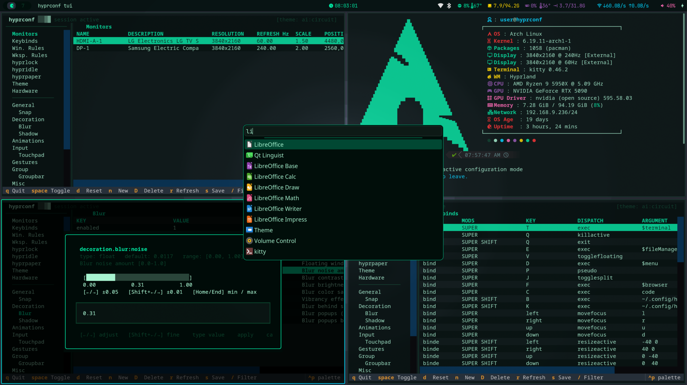

<p align="center">
  
</p>

<p align="center">
  <a href="https://hyprconf.sh"></a>
  
  
  
  
</p>

<p align="center">
  
</p>

# .hyprconf

**hyprconf** is a Hyprland configuration suite for Arch Linux — combining a standalone CLI/TUI tool with the maintainer's fully-managed personal dotfiles. The tool is independently usable by any Hyprland user (AUR-compatible); the dotfiles are the daily-driven reference implementation built on top of it.

---

## Two Components

| Component | Description |
|---|---|
| **`hyprconf`** | AUR-compatible CLI + TUI for configuring Hyprland — get/set options, manage keybinds, rules, monitors, themes, lock/idle/wallpaper daemons, and more. Installable standalone. |
| **Dotfiles** | The maintainer's Arch Linux + Hyprland configuration, managed via GNU Stow. Bootstrapped from a single command; demonstrates and depends on `hyprconf`. |

---

## Features

- **`hyprconf` CLI** — unified control: `hyprconf theme random`, `hyprconf set general gaps_in 8`, `hyprconf keybind add`, `hyprconf monitor set bedroom`, `hyprconf configure` (IOS-style REPL), and more
- **`hyprconf tui`** — full-screen Textual TUI with arrow-selectable pickers for enums, interactive sliders for numeric fields, and mode lists fetched from `hyprctl`; covers all Hyprland config sections (general, decoration, animations, input, gestures, group, misc, binds, cursor, render, opengl, xwayland, dwindle, master and their subsections), plus keybinds, window/workspace rules, monitors, hyprlock, hypridle, hyprpaper, and a built-in theme picker
- **One-command setup** — installs packages (including `yay` AUR helper), configures ZSH, stows all configs, and launches Hyprland; full Arch ISO install supported
- **`hyprconf sync`** — pull latest changes, re-stow, and re-apply services without reinstalling packages; `--force` to hard-reset a diverged branch, `--full` to restow all dotfiles
- **`hyprconf repair`** — scan and fix stow tree corruption, broken symlinks, Python import issues, and monitor config mismatches
- **Chassis-aware monitor config** — detects desktop vs laptop via DMI chassis type (`/sys/class/dmi/id/chassis_type`), falling back to battery absence; auto-selects `pcMonitors.conf` or `laptopMonitors.conf` at setup
- **Automatic power profile switching** — on battery devices, a udev rule triggers `hyprconf-power-monitor` on AC plug/unplug: sets `performance` when plugged in, `power-saver` on battery; manually override anytime with `hyprconf power-profile <mode>`
- **Keychron / Lemokey HID access** — installs a udev rule (`70-keychron.rules`) granting the active session user read/write access to the `hidraw` device for Keychron keyboards (vendor ID `0x3434`) and Lemokey keyboards (vendor ID `0x362d`); enables in-browser key remapping at [launcher.keychron.com](https://launcher.keychron.com) (WebHID) with no extra privileges; applied automatically on every `hyprconf sync`
- **Hardware auto-detection** — touchscreen devices get `wvkbd` (AUR on-screen keyboard, auto-shows on text focus; toggle: `Super+Shift+O`) and a floating `touch-panel` overlay (started at session start if no keyboard is detected; also started at runtime when a keyboard is unplugged); accelerometer/gyroscope devices get `iio-sensor-proxy` + `autorotate` (maps orientation → Hyprland transform); all re-evaluated on every `hyprconf sync`
- **GPU passthrough (VFIO)** — mode-based multi-GPU passthrough using direct sysfs binding (no libvirt): `hyprconf hardware gpu mode vm` binds the GPU + entire IOMMU group to vfio-pci; `mode host` restores the host driver; setup wizard auto-applies IOMMU kernel params and driver isolation (NVIDIA blacklist for single-GPU, dual boot entries with `vfio-pci.ids` for multi-NVIDIA — select "GPU Passthrough" at the boot menu); includes a Docker-based Windows VM launcher (`hyprconf hardware gpu vm`) using `dockurr/windows` with Looking Glass for near-native display; comprehensive VM anti-detection (SMBIOS, CPU flags, device elimination, disk identity) for anti-cheat evasion (EAC, VAC); installed via `hyprconf addon vfio`
- **Hot-swappable monitor presets** — switch between bedroom/kitchen layouts at runtime via keybind
- **Full-desktop theme switcher** — 68 themes applied simultaneously to Hyprland borders, Waybar, Kitty, Dunst, hyprlock, VS Code / Code OSS, Firefox, LibreWolf, GTK3/4, Qt/KDE apps, Dolphin, wvkbd, touch-panel, btop, and wallpaper; `hyprconf theme generate <image>` extracts a palette from any wallpaper to create a new theme automatically
- **Privacy-hardened Firefox** — out-of-the-box enterprise `policies.json`: all telemetry disabled, vertical tabs enabled, uBlock Origin force-installed; comprehensive `user.js` privacy prefs applied on every theme switch. Add **LibreWolf** (privacy fork — RFP, no telemetry) via `hyprconf addon librewolf`; it's auto-themed by the same engine
- **VPN & kill-switch** — `hyprconf vpn` manages any NetworkManager VPN profile (OpenVPN or WireGuard) provider-agnostically: `status`/`list`/`connect`/`disconnect`/`import`, plus a waybar indicator. `hyprconf vpn killswitch on` enforces fail-closed VPN-only networking — delegating to ProtonVPN's maintained kill-switch when the `vpn` addon is installed, or a self-contained nftables egress guard otherwise. ProtonVPN's official CLI (NetShield, Secure Core) installs via `hyprconf addon vpn`
- **Screen lock & idle** — hyprlock (blurred screenshot), hypridle (dim → lock → DPMS → suspend), clipboard wiped on lock
- **YubiKey FIDO2 login** *(optional)* — `yubikey-fido2-setup` interactively enrols a FIDO2+PIN key for `sudo`, TTY login, display manager, SSH, and LUKS unlock at boot (`systemd-cryptenroll`); every edited file is backed up and rolled back on failure. hyprlock is actively kept password-only — it's repointed at `system-auth` so it can't inherit the key requirement from `login` and lock you out
- **Utilities** — `hyprconf doctor` (system health check), `hyprconf clipboard` (history picker), `hyprconf screenshot` (region/window/full + annotation), `hyprconf gamemode` (toggle performance mode), `hyprconf power` (lock/logout/suspend/reboot/shutdown), `hyprconf power-profile` (query/switch power profiles; auto-switches on AC plug/unplug), `hyprconf nightlight` (blue light filter), `hyprconf colorpicker` (screen colour picker), `hyprconf record` (screen recording)
- **Cloud deploy** — serve your own install endpoint via `hyprconf deploy` (S3 + CloudFront + ACM + Route53)

---

## Requirements

- Arch Linux (uses `pacman`) — or the **Arch ISO** for a full install
- Git, `curl`, `stow` (installed by the script if needed)
- A running Hyprland session (for live `hyprctl` features)

---

## Installation

```bash
bash <(curl -fsSL hyprconf.sh)
```

The installer prompts for one of three modes:

### [1] Full Arch Linux install *(from the Arch ISO)*

Prompts for username, password, hostname, timezone (auto-detected), network config carry-over, target disk, and partition mode. Then:

1. Partitions disk — **full wipe** or **unallocated space** (preserves existing partitions; reuses or creates EFI)
2. LUKS2 encryption (AES-XTS 512-bit) on root
3. btrfs with subvolumes: `@` `/`, `@home` `/home`, `@snapshots` `/.snapshots`, `@var_log` `/var/log`
4. `pacstrap` — base system, CPU microcode, NetworkManager, iwd, ZSH
5. Chroot config: locale, timezone, hostname, `mkinitcpio` (systemd + sd-encrypt), `systemd-boot`, user account, TTY1 auto-login
6. Pre-clones repo; first-boot hook runs `setup.sh` automatically on login

### [2] Dotfiles only *(existing Arch system)*

Clones the repo from the stable release branch using a sparse checkout and runs `setup.sh`:

1. System update + package install from `packages`
2. Create required directories
3. Oh My Zsh + Powerlevel10k
4. `~/.zshrc` (plugins, aliases, fastfetch greeting) + `~/.zprofile` (Hyprland auto-start on TTY1)
5. Stow all packages into `$HOME`
6. VS Code theme extensions + Firefox extension payloads
7. Firefox enterprise policies (`/etc/firefox/policies/policies.json`): telemetry disabled, uBlock Origin installed
8. Chassis-type-aware monitor config symlink (DMI → desktop vs laptop)
9. Hardware feature detection: touchscreen → installs `wvkbd` (AUR) + writes `conf.d/60-hardware.conf`; accelerometer → installs + enables `iio-sensor-proxy`
10. Automatic power profile switching on battery devices: installs udev rule (`99-hyprconf-power.rules`) → `performance` on AC, `power-saver` on battery
11. Keychron / Lemokey HID permissions: installs udev rule (`70-keychron.rules`) for Keychron (`0x3434`) and Lemokey (`0x362d`) → `TAG+="uaccess"` so `launcher.keychron.com` (WebHID) can remap keys
12. `ufw` deny-inbound / allow-outbound; enable + start
13. Disable `sddm`; enable `NetworkManager`, `iwd`, `bluetooth`, `power-profiles-daemon`; configure NM to use iwd as wifi backend
14. Reload Hyprland

> **WiFi:** if no wifi profiles were copied from the ISO (e.g. ethernet install), connect after first boot with `nmtui`.

> **AUR dependency:** `bibata-cursor-theme` must be installed manually: `yay -S bibata-cursor-theme`

### [3] hyprconf only *(any existing Hyprland system)*

Installs just the `hyprconf` CLI/TUI binary into `~/.local/bin` and its library into `~/.local/lib` — no dotfiles, no config changes.

1. Sparse-clones the repo (CLI/library paths only)
2. Copies `hyprconf` binary to `~/.local/bin/`
3. Copies Python library to `~/.local/lib/hyprconf/`
4. Ready to use: `hyprconf --help`

### Sync / Repair

```bash
hyprconf sync          # pull, re-apply services, reload Hyprland (always config-safe)
hyprconf sync --force  # discard local divergence, hard-reset to remote branch
hyprconf sync --full   # as above + full dotfile restow (resets configs to repo defaults)
hyprconf repair        # fix stow tree, broken symlinks, Python imports, monitors.conf
hyprsync               # backward-compatible alias for hyprconf sync
```

`hyprconf sync` is **always config-safe** — additive-only stow creates symlinks for new files but never replaces files you've modified. `--force` hard-resets a diverged branch; `--full` restows all dotfiles. `~/.config/hypr/conf.d/99-hyprconf-local.conf` (written by `hyprconf set` / TUI) is machine-local, never managed by stow or git, and survives all sync modes.

---

## Repository Layout

See [`docs/CONTRIBUTING.md`](docs/CONTRIBUTING.md) for the full directory tree, test architecture, and developer workflow.

Key paths:

| Path | Purpose |
|---|---|
| `stow/hypr/.local/bin/hyprconf` | CLI entry point |
| `stow/hypr/.config/hypr/scripts/` | Theme engine, TUI, monitor switching |
| `stow/hypr/.local/lib/hyprconf/` | Python library (schema, config, keybinds, …) |
| `setup.sh` | Bootstrap + sync entry point |
| `packages` | Arch packages (one per line) |
| `install/install.sh` | Self-contained installer (served from CloudFront) |
| `web/` | React frontend for hyprconf.sh |
| `infra/` | AWS CDK stack + deploy wrapper + CloudFront function |

---

## Website

The project website at **[hyprconf.sh](https://hyprconf.sh)** is a React SPA with a retro-futuristic design. Browser visitors see the full site; `curl`/`wget` requests still receive `install.sh`.

| Page | Route | Content |
|---|---|---|
| Landing | `/` | Hero, feature overview, install command |
| Themes | `/themes` | 68-theme gallery with live preview + filter |
| Keybindings | `/keybindings` | Categorized keybinding reference with search |
| CLI Reference | `/cli` | Accordion-based command reference |
| Installation | `/install` | Three install modes with step-by-step guides |

**Tech stack:** React 19, TypeScript, Vite, Radix UI, CSS Modules, Vitest + RTL.

**Theme sync:** Themes are generated at build time from the same JSON files used by the desktop theme engine. Run `cd web && npm run generate-themes` after adding themes.

**Deploy:** `hyprconf deploy` handles the full pipeline via AWS CDK (S3, CloudFront, ACM, Route53, and web frontend). For web-only updates: `hyprconf deploy web`. `web/deploy.sh` is a thin wrapper around the same pipeline. Requires configured AWS credentials (`aws configure`).

---

## hyprconf CLI

The `hyprconf` script lives at `~/.local/bin/hyprconf` (stowed). It is the single entry point for all configuration tasks.

### Command Reference

```
# Themes
hyprconf theme                   Interactive TUI picker
hyprconf theme <name>            Apply a specific theme
hyprconf theme random / next / prev / current / list
hyprconf theme pick              Select via hyprlauncher
hyprconf theme filter <str>      Filter themes in TUI
hyprconf theme generate <image>  Generate theme from wallpaper colours

# Hyprland options (persistent + live via hyprctl)
hyprconf get [section] [key]
hyprconf set <section> <key> <value>
hyprconf set mainMod <key>        Change the main modifier key

# Interactive Cisco IOS-style REPL
hyprconf configure / conf         Enter configure mode
#   general                      Enter section context
#   gaps_in 8                    Set option
#   no gaps_in                   Reset to default
#   show / ? / exit

# Keybinds
hyprconf keybind list / add / delete / update
hyprconf show keybind            Pretty table from config

# Window & workspace rules
hyprconf rule window  list / add / delete / update
hyprconf rule workspace list / add / delete / update

# Monitor presets
hyprconf monitor list / <preset> / set <preset>
hyprconf monitor config list / set <name> <res> <pos> <scale> [extras…] / delete <name>

# Display
hyprconf display toggle          Toggle eDP-1 on/off

# Lock screen (hyprlock)
hyprconf lock list / add / set / delete

# Idle daemon (hypridle)
hyprconf idle list / add / set / delete

# Wallpaper daemon (hyprpaper)
hyprconf paper list
hyprconf paper set-wallpaper <monitor|-> <path>
hyprconf paper add-preload <path>
hyprconf paper delete-wallpaper <index>
hyprconf paper delete-preload <index>
hyprconf paper setting <key> <value>

# Full Textual TUI
hyprconf tui
hyprconf tui --section general
hyprconf tui --slim

# Sync / repair
hyprconf sync
hyprconf sync --force            Discard local divergence, reset to remote
hyprconf sync --full             Full dotfile restow (reset configs to defaults)
hyprconf repair

# Cloud deploy
hyprconf deploy [list | new | web | <domain>]
hyprconf teardown

# Schema (for AI/tooling)
hyprconf schema dump / validate / list-sections / keys <section>
hyprconf autodetect              Detect + migrate existing config

# Hardware
hyprconf hardware status         Show detected hardware and daemon status
hyprconf hardware osk [on|off|toggle]  Control on-screen keyboard (wvkbd)
hyprconf hardware rotate [on|off]      Control auto-rotation (autorotate)
hyprconf hardware gpu                  GPU passthrough status overview
hyprconf hardware gpu detect           List GPUs with PCI addresses, IOMMU groups, drivers
hyprconf hardware gpu setup            Interactive VFIO setup wizard
hyprconf hardware gpu audit            Full system readiness check
hyprconf hardware gpu mode             Show current GPU mode (vm/host/none)
hyprconf hardware gpu mode vm [gpu]    Bind GPU to vfio-pci for VM passthrough (--force to override safety)
hyprconf hardware gpu mode host [gpu]  Restore GPU to host driver
hyprconf hardware gpu mode none [gpu]  Unbind GPU from all drivers
hyprconf hardware gpu vm install       Interactive Windows VM setup wizard
hyprconf hardware gpu vm launch        Bind GPU + start VM (--force to override safety checks)
hyprconf hardware gpu vm connect       Connect via Looking Glass or RDP (--rdp, --stop-on-disconnect|-s)
hyprconf hardware gpu vm stop          Stop the Windows VM container
hyprconf hardware gpu vm status        Show VM config, GPU state, container status
hyprconf hardware gpu vm remove        Remove VM container, image, and config (preserves ~/Windows/)
hyprconf hardware gpu vm usb [list]    List USB devices available for passthrough
hyprconf hardware gpu vm usb add       Interactively attach a USB device to the running VM
hyprconf hardware gpu vm usb remove    Interactively detach a USB device from the VM
hyprconf hardware gpu report           Detailed hardware report
hyprconf hardware gpu diagnose         Detailed diagnostic dump

# Security
hyprconf yubikey status          Show keys, PAM coverage, and LUKS FIDO2 slots (read-only)
hyprconf yubikey setup           Full FIDO2+PIN setup (sudo/TTY/DM/SSH/LUKS)
hyprconf yubikey enroll          Enroll an additional / backup key (login + LUKS slot)

# VPN / Network privacy
hyprconf vpn status [--json]     Show VPN connection + kill-switch state
hyprconf vpn list                List configured VPN profiles
hyprconf vpn connect [name]      Bring up a VPN (default: the only profile)
hyprconf vpn disconnect [name]   Tear down the active (or named) VPN
hyprconf vpn toggle              Connect if down, disconnect if up (waybar click)
hyprconf vpn import <file>       Import an OpenVPN .ovpn / WireGuard .conf
hyprconf vpn killswitch on|off|status   Fail-closed VPN-only mode

# Utilities
hyprconf doctor                  System health check (packages, services, configs, symlinks)
hyprconf clipboard [fzf|rofi|wipe]  Clipboard history picker (cliphist)
hyprconf screenshot [region|window|full|edit]  Screen capture (hyprshot + swappy)
hyprconf gamemode [on|off|toggle|status]  Toggle performance mode (no animations/blur/gaps)
hyprconf power [lock|logout|suspend|reboot|shutdown]  Power menu
hyprconf power-profile [status|performance|balanced|power-saver|auto]  Power profile control
hyprconf nightlight [on|off|toggle|status]  Blue light filter (hyprsunset/wlsunset)
hyprconf colorpicker [hex|rgb]   Pick colour from screen → clipboard (hyprpicker)
hyprconf record [start|stop|toggle|status]  Screen recording (wf-recorder)

# Addons
hyprconf addon                   List available addons and their status
hyprconf addon <name>            Install a named addon (e.g. dev, vfio, vpn, librewolf)

# Developer
hyprconf dev                     Show developer pipeline commands
hyprconf dev test [--unit|--integration|--tui|--vm|--install|--all]
hyprconf dev vm [start|stop|stop-all|build|status]
hyprconf dev publish             Full pipeline: tests → deploy → stable promote

hyprconf help
```

### Persistence

All changes via `hyprconf set`, `hyprconf configure`, or the TUI are applied immediately via `hyprctl keyword` and written persistently to:

```
~/.config/hypr/conf.d/99-hyprconf-local.conf
```

This file is sourced by Hyprland on every restart via the `conf.d/*.conf` glob.

---

## Theme Switcher

### Theme Flags

| Flag | Equivalent | Description |
|---|---|---|
| `--list` / `-l` | `theme list` | Print colour table |
| `--current` / `-c` | `theme current` | Show active theme |
| `--next` / `-n` | `theme next` | Next alphabetically |
| `--prev` / `-p` | `theme prev` | Previous |
| `--random` / `-r` | `theme random` | Random pick |
| `--pick` / `-w` | `theme pick` | Hyperlauncher picker |
| `--filter STR` / `-f` | `theme filter <str>` | Substring filter (matches name **or** `appearance` tag — use `light` / `dark`) |
| `--no-reload` | | Skip `hyprctl reload` |

### Available Themes

**Community (47):**

| | | | |
|---|---|---|---|
| `adapta` | `adwaita` | `adwaita-dark` | `ayu-dark` |
| `ayu-mirage` | `catppuccin-frappe` | `catppuccin-latte` | `catppuccin-macchiato` |
| `catppuccin-mocha` | `cyberdream` | `dracula` | `dusklight` |
| `elementarish` | `everforest-dark` | `everforest-light` | `flat-remix` |
| `flat-remix-light` | `gotham` | `greyscale` | `gruvbox` |
| `gruvbox-light` | `gruvbox-material-dark` | `horizon` | `hot-purple-traffic-light` |
| `kanagawa` | `kanagawa-lotus` | `kyli0x` | `matcha-dark-sea` |
| `monokai-pro` | `night-owl` | `nord` | `one-dark` |
| `oxocarbon` | `palenight` | `paper` | `phoenix-night` |
| `rose-pine` | `rose-pine-dawn` | `rose-pine-moon` | `shades-of-purple` |
| `solarized-dark` | `solarized-light` | `tokyo-moon` | `tokyo-night` |
| `tokyo-storm` | `tomorrow-night` | `whiteout` | |

**AI-original (21) — prefix `ai:`:**

| Theme | Palette concept |
|---|---|
| `ai:void` | Near-black void with electric violet |
| `ai:phosphor` | CRT phosphor green on deep black |
| `ai:ember` | Charred black with smoldering orange |
| `ai:glacier` | Crisp ice-white light theme with steel blue |
| `ai:midnight-bloom` | Deep navy with exotic fuchsia |
| `ai:ash` | Cold grey ash with burning crimson |
| `ai:deep-sea` | Ocean trench black with teal-cyan |
| `ai:neon-noir` | Dark concrete with electric neon green |
| `ai:copper` | Warm dark brown with oxidized copper |
| `ai:steel` | Industrial blue-grey with electric blue |
| `ai:aurora` | Dark grey-navy with aurora green |
| `ai:bioluminescence` | Pitch black with glowing cyan organisms |
| `ai:solar-flare` | Near-black space with plasma orange |
| `ai:crimson-tide` | Deep ocean dark with blood crimson |
| `ai:forest-floor` | Earthy dark brown with moss green |
| `ai:lavender-haze` | Dark purple-grey with soft amethyst |
| `ai:obsidian` | Pure volcanic black with sharp amber |
| `ai:sakura` | Dark ink wash with cherry blossom pink |
| `ai:circuit` | PCB dark green with circuit-trace cyan |
| `ai:dusk` | Dark dusty purple with desert sunset orange |
| `ai:btop-tty` | Classic ANSI 16-colour palette from btop's TTY mode |

> `ai:` themes auto-generate a Kitty colour config from their palette. All include a `vscode` block mapped to the nearest community extension. Use `--filter ai:` to show only AI themes.

### Adding a Theme

Create a JSON file in `stow/hypr/.config/hypr/scripts/theme-switcher/themes/`:

```json
{
  "background": "#1e1e2e",
  "foreground": "#cdd6f4",
  "comment":    "#6c7086",
  "accent":     "#f5c2e7",
  "appearance": "dark",
  "wallpaper":  "~/wallpaper/my-theme.png",
  "kitty":      "~/.config/kitty/themes/my-theme.conf",
  "vscode":  { "theme": "Theme Name", "extension": "publisher.id", "font": "JetBrainsMono Nerd Font" },
  "firefox": { "theme_name": "Theme Name", "theme_id": "{uuid}" }
}
```

`appearance` is `"light"` or `"dark"` — used by `--filter` and shown in `--list`. Auto-generated themes set it from background luminance.

`kitty`, `vscode`, `firefox`, `wallpaper`, and `btop` are all optional.

The `btop` key accepts a system theme name (looked up in `/usr/share/btop/themes/`) or an absolute path. If omitted, a `.theme` file is auto-generated from the palette into `~/.config/btop/themes/`.

---

## Monitor Configuration

| Device type detected | Config symlinked |
|---|---|
| Desktop (chassis type 3–7, 13, 24) | `pcMonitors.conf` — HDMI-A-1 4K@120Hz HDR + DP-1 4K@240Hz |
| Laptop / portable (all other types) | `laptopMonitors.conf` — eDP-1 preferred + external connectors use `preferred` + catch-all wildcard |
| Unknown chassis (fallback) | No battery present → desktop; battery present → laptop |

Hot-swap presets activate at runtime via keybind or `hyprconf monitor set <preset>`:

| Keybind | Preset |
|---|---|
| `Super + Shift + B` | `pcMonitors.bedroom` |
| `Super + Shift + K` | `pcMonitors.kitchen` |

`pcMonitors.K` is an alternate desktop preset using Hyprland's newer `monitorv2` block syntax (DP-1 4K@240Hz, DP-2 4K@75Hz rotated, HDMI-A-1 4K@120Hz with HDR). Apply manually: `hyprconf monitor set K` → copies it to `monitors.conf` and reloads.

---

## Gestures

Touchpad workspace swiping is configured in `gestures.conf`:

| Setting | Value | Effect |
|---|---|---|
| `workspace_swipe_invert` | `true` | Natural (content-follows-finger) swipe direction |
| `workspace_swipe_distance` | `300` | Pixels to travel for a full swipe |
| `workspace_swipe_min_speed_to_force` | `15` | Minimum speed (px/s) to force completion |
| `workspace_swipe_cancel_ratio` | `0.5` | Below 50% → cancel and return to current workspace |
| `workspace_swipe_create_new` | `true` | Swipe past last workspace creates a new one |
| `workspace_swipe_direction_lock` | `true` | Locks swipe axis after threshold distance |
| `workspace_swipe_direction_lock_threshold` | `10` | Distance (px) before axis locks |
| `workspace_swipe_forever` | `true` | Keeps animating beyond the threshold distance |

---

## Autostart Services

`hyprland.conf` starts these on session init:

| Command | Purpose | Restart policy |
|---|---|---|
| `pkill hyprpaper; hyprpaper --config ~/.config/hypr/hyprpaper.conf` | Wallpaper daemon | Restarted on every `exec` (config reload safe) |
| `pkill waybar; waybar -c ~/.config/waybar/waybar.jsonc -s ~/.config/waybar/waybar.css` | Status bar | Restarted on every `exec` |
| `/usr/lib/pam_kwallet_init` | KDE Wallet PAM init | Once |
| `kwalletd6` | KDE Wallet daemon (SSH/GPG key storage) | Once |
| `systemctl --user start hyprpolkitagent` | Polkit agent (privilege elevation dialogs) | Once |
| `xsettingsd` | GTK/X11 settings bridge (cursor, icon theme) | Once |
| `hypridle` | Idle/lock daemon | Once |
| `wl-paste … cliphist store` ×2 | Clipboard history (text + image) | Once |
| `nm-applet --indicator` | NetworkManager tray icon | Once |
| `blueman-applet` | Bluetooth tray icon | Once |

---

## Hardware Auto-Detection

Runs at every `setup.sh` invocation and `hyprconf sync`. Results are written to
`~/.config/hypr/conf.d/60-hardware.conf` (machine-local, not stowed).

### Touchscreen

Detection (checked in order):
1. `/sys/class/input/*/device/uevent` → `ID_INPUT_TOUCHSCREEN=1` — standard HID touchscreens (ELAN, etc.)
2. Same path → `ID_INPUT_TOUCH=1` — generic touch devices (e.g. ASUS ROG Ally, some AMD-based handhelds) that don't set `ID_INPUT_TOUCHSCREEN`
3. Same path → `NAME="Wacom * Finger"` + `PHYS="i2c-*"` — Wacom I2C pen+touch digitizers (ThinkPad Yoga, Surface-style devices) whose driver bypasses the generic udev HID rules and never sets `ID_INPUT_TOUCHSCREEN=1`

Installs **`wvkbd`** (AUR, requires `yay`) — a minimal wlroots on-screen keyboard.

| Behaviour | Detail |
|---|---|
| Auto-show | Appears when a text input is focused (`text-input-v3` protocol) |
| Manual toggle | `Super + Shift + O` |
| Theme integration | `hyprconf theme` writes `~/.config/wvkbd/colors` and restarts the daemon |

#### Touch panel (runtime keyboard detection)

On any device with a touchscreen, `setup.sh` installs **`gtk-layer-shell`** and adds two entries to `conf.d/60-hardware.conf`:

- **`touch-panel-launcher`** — runs at Hyprland session start; checks for a physical keyboard (`ID_INPUT_KEYBOARD=1` + non-empty `PHYS` in sysfs); starts `touch-panel` only if none is found.
- **`touch-panel-watch`** — background daemon using `udevadm monitor`; watches for input device removals during the session; starts `touch-panel` when the last physical keyboard is unplugged.

This means the panel appears correctly whether a keyboard was present at install time or unplugged mid-session.

`touch-panel` is a minimal GTK3 + layer-shell floating overlay anchored to the bottom-right:

- **Normal state** — small circular FAB (☰)
- **Expanded** — compact pill with ⌨ OSK toggle and ⊞ launcher buttons
- Colours sourced from `~/.config/touch-panel/colors` (written by `hyprconf theme`); reloaded live on `SIGUSR1`

### Accelerometer / Auto-Rotation

Detection: `/sys/bus/iio/devices/*/in_accel_x_raw`

Installs **`iio-sensor-proxy`** (official repos) and enables `iio-sensor-proxy.service`.
The `autorotate` daemon watches `monitor-sensor` events and applies the matching
Hyprland transform to the built-in display (`eDP-*`):

| Sensor orientation | Hyprland transform |
|---|---|
| normal | 0 (0°) |
| left-up | 1 (90°) |
| bottom-up | 2 (180°) |
| right-up | 3 (270°) |

### GPU Passthrough (VFIO)

Mode-based GPU passthrough for multi-GPU desktops using direct sysfs binding (no libvirt). On single-GPU + iGPU systems, the NVIDIA driver is blacklisted at boot (`install nvidia /bin/false`) and GPU modes switch at runtime — no reboot required. On dual-NVIDIA systems, `hyprconf hardware gpu setup` creates two boot entries sharing the same kernel: a **Normal** entry (both GPUs on nvidia) and a **GPU Passthrough** entry (`vfio-pci.ids=VENDOR:DEVICE` in kernel cmdline so the passthrough GPU is claimed by vfio-pci at boot). Select the desired entry at the systemd-boot menu — no runtime nvidia unbind needed, which avoids the kernel deadlock caused by the shared nvidia module.

**Install:** `hyprconf addon vfio` (installs QEMU, OVMF, Docker, dmidecode, Looking Glass, and loads VFIO + kvmfr modules).

**Setup:** `hyprconf hardware gpu setup` — interactive wizard that detects CPU vendor, auto-applies IOMMU kernel params (systemd-boot, GRUB, or Limine), configures driver isolation (NVIDIA blacklist for single-GPU, or dual boot entries + mkinitcpio module ordering for multi-NVIDIA), and prompts you to choose which GPU to reserve for passthrough.

`[gpu]` accepts: PCI address (`01:00.0`), model name (`3070`, `5090`), or ordinal (`nvidia0`, `nvidia1`). When omitted, uses the GPU saved during `setup`.

| Command | Action |
|---|---|
| `hyprconf hardware gpu` | Status overview — IOMMU, GPU modes, configured GPU |
| `hyprconf hardware gpu detect` | List all GPUs with PCI addresses, IOMMU groups, audio devices, current drivers |
| `hyprconf hardware gpu audit` | Full system readiness check (IOMMU, modules, packages, driver isolation, boot entries) |
| `hyprconf hardware gpu mode` | Show current GPU mode (`vm`, `host`, or `none`) |
| `hyprconf hardware gpu mode vm [--force] [gpu]` | Bind GPU + IOMMU group to vfio-pci (multi-NVIDIA: requires "GPU Passthrough" boot entry) |
| `hyprconf hardware gpu mode host [gpu]` | Unbind from vfio-pci → reload native driver |
| `hyprconf hardware gpu mode none [gpu]` | Unbind GPU from all drivers (idle state) |
| `hyprconf hardware gpu vm install` | Interactive wizard — set RAM, CPU, disk, Windows version, credentials |
| `hyprconf hardware gpu vm launch [--force]` | Start Docker container with GPU passthrough (VM persists until stopped) |
| `hyprconf hardware gpu vm connect [--rdp] [-s]` | Connect to running VM via Looking Glass (falls back to RDP); `-s`/`--stop-on-disconnect` stops VM on RDP exit |
| `hyprconf hardware gpu vm stop` | Stop the Windows VM container |
| `hyprconf hardware gpu vm status` | Show VM config, GPU binding state, container status |
| `hyprconf hardware gpu vm remove` | Remove container, image, and config (preserves `~/Windows/` shared folder) |
| `hyprconf hardware gpu vm usb [list\|add\|remove]` | Hot-plug USB devices into/out of the running VM via QEMU monitor |
| `hyprconf hardware gpu report` | Comprehensive hardware report (system, motherboard, GPUs, IOMMU groups, drivers) |
| `hyprconf hardware gpu diagnose` | Detailed diagnostic dump (dmesg, IOMMU groups, modules, config) |

**Dual-NVIDIA boot entries:** `setup` creates `hyprconf-vm.conf` in `/boot/loader/entries/` (systemd-boot) or a GRUB custom menuentry. The VM entry duplicates the default entry and appends `vfio-pci.ids=<gpu>,<audio>`. mkinitcpio is configured with `vfio-pci` before `nvidia` in MODULES so vfio-pci loads early enough to claim the device. `hyprconf sync` keeps boot entries and initramfs config in sync. The normal entry is not modified — vfio-pci loads but claims nothing without `vfio-pci.ids` in the cmdline.

**Windows VM:** Uses `dockurr/windows` Docker image (QEMU internally) with GPU forwarded via vfio-pci and [Looking Glass](https://looking-glass.io/) for near-native display latency. First run: `hyprconf hardware gpu vm install` to configure resources and IVSHMEM size. Then `hyprconf hardware gpu vm launch` to start the VM — it persists until explicitly stopped. `hyprconf hardware gpu vm connect` launches Looking Glass (falls back to RDP if `looking-glass-client` not installed). The GPU must have a physical display connected (second monitor, second cable, or HDMI/DP dummy plug). First boot: Windows installs on the GPU-connected display — install GPU drivers and the Looking Glass host app. Audio plays through HDMI from the passthrough GPU. Shared folder at `~/Windows/` is mounted as a network drive. **OEM auto-install:** Steam, Epic Games Launcher, Battle.net, Firefox, and the Looking Glass Host app are automatically installed during first boot via an OEM `install.bat` — no manual downloads needed. All Windows privacy settings are maximised: telemetry disabled, advertising ID off, Cortana off, DiagTrack service stopped, Copilot/Recall/widgets disabled, activity history off, location denied, app launch tracking off. The user account is created automatically (no OOBE prompt). All dependencies are installed by `hyprconf addon vfio`.

**Anti-cheat evasion:** The VM uses a multi-layer anti-detection strategy mirroring [omarchy](https://github.com/basecamp/omarchy):

| Layer | Mechanism | Effect |
|---|---|---|
| **SMBIOS** | Types 0 (BIOS + `uefi=on`), 1 (system + UUID), 2 (baseboard), 3 (chassis), 4 (processor), 17 (memory via dmidecode) | Guest sees real host manufacturer/product/RAM instead of "QEMU Standard PC" |
| **CPU flags** | `CPU_FLAGS` env: `-hypervisor,hv_vendor_id=<vendor>,family=X,model=Y,stepping=Z` | Hides hypervisor CPUID bit; passes real CPU identity |
| **Machine type** | `MACHINE: "q35"` | Modern chipset (vmport=off, hpet=off via Dockurr defaults) |
| **Display** | `DISPLAY: "none"` | Eliminates VirtIO GPU — no Red Hat display adapter in Device Manager |
| **Network** | `ADAPTER: "e1000e"` | Intel 82574L NIC instead of VirtIO — no Red Hat network driver |
| **Disk controller** | `DISK_TYPE: "sata"` | SATA (ich9-ahci) instead of VirtIO SCSI — no Red Hat SCSI controller |
| **Disk identity** | `-global ide-hd.model/serial` + `-global ide-cd.model` from host disk | Guest disk appears as real hardware, not "QEMU HARDDISK" |
| **USB** | `USB: "no"` + conditional `qemu-xhci` only when USB passthrough configured | No unnecessary virtual USB controller |
| **Power** | `-global ICH9-LPC.disable_s3=1 -global ICH9-LPC.disable_s4=1` | Prevents suspend/hibernate which breaks GPU passthrough |
| **Looking Glass** | ivshmem shared memory | Near-native display via physical GPU, no virtual VGA needed |
| **OEM auto-install** | `/oem` volume → `install.bat` runs post-setup | Steam, Epic, Battle.net, Firefox, Looking Glass Host installed; max privacy settings applied (telemetry off, ad ID off, Copilot/Recall/widgets disabled, DiagTrack stopped) |
| **Hyper-V passthrough** | Dockurr default `hv_passthrough` + our `-hypervisor` override | Hyper-V enlightenments active but hypervisor bit hidden |

This is sufficient for EAC (Fortnite, The Finals), VAC (CS2), and most anti-cheat systems. Riot Vanguard (VALORANT) and kernel-level anti-cheat (Javelin/BF6) use deeper detection and are not bypassed.

**Workflow (dual-NVIDIA):** Reboot → select "GPU Passthrough" at boot menu → `hyprconf hardware gpu vm launch` → VM starts with GPU. `hyprconf hardware gpu vm connect` to launch Looking Glass. To return to full desktop: `hyprconf hardware gpu vm stop`, then `hyprconf hardware gpu mode host`, then reboot with the normal entry.

**Workflow (single-GPU + iGPU):** `hyprconf hardware gpu mode vm` unbinds nvidia and binds to vfio-pci. `hyprconf hardware gpu vm launch` starts the Docker container. `hyprconf hardware gpu vm connect` launches Looking Glass (or RDP). VM persists until `hyprconf hardware gpu vm stop`. Return GPU to host: `hyprconf hardware gpu mode host`.

**Prerequisites:** `sudo modprobe kvmfr static_size_mb=N` (32 for 1080p, 64 for 1440p, 128 for 4K). Add to `/etc/modules-load.d/` for persistence. GPU must have a display connected (second monitor or dummy plug).

Config stored at `~/.config/hyprconf/gpu-passthrough.conf` (GPU) and `~/.config/hyprconf/gpu-vm.conf` (VM). Boot-time binding is synced automatically via `hyprconf sync` for multi-NVIDIA setups. Doctor checks IOMMU, VFIO modules, kvmfr, Docker service, and user groups when the `vfio` addon is installed.

---

## Screen Lock & Idle

| Timeout | Action |
|---|---|
| 4 min | Dim display to 10% |
| 45 min | Wipe clipboard + lock (hyprlock) |
| 90 min | Displays off (DPMS) |
| 3 hr | Suspend (`systemctl suspend`) |

Lock manually: `Super + L` or `Super + Shift + Escape`.

hyprlock shows a blurred desktop screenshot, live clock, and password input.

---

## YubiKey FIDO2 Login *(optional)*

Hardware-backed FIDO2+PIN authentication for an Arch + Hyprland system, driven
through the CLI:

```bash
hyprconf yubikey status    # keys, PAM coverage, LUKS FIDO2 slots (read-only)
hyprconf yubikey setup     # full first-time setup (sudo/TTY/DM/SSH/LUKS)
hyprconf yubikey enroll    # add an additional / backup key (login + LUKS slot)
```

`hyprconf yubikey` escalates with `sudo` as needed and delegates to the stowed
`yubikey-fido2-setup` helper (also runnable directly: `sudo yubikey-fido2-setup
[setup|enroll|status]`).

`setup` is fully interactive and idempotent — each step is opt-in, every modified
file is backed up to `/tmp/yubikey-backup-<timestamp>/`, and any failure offers to
roll back all changes. It covers:

| Surface | What it configures |
|---|---|
| Packages | Installs `libfido2`, `pam-u2f`, `yubikey-manager` if missing |
| FIDO2 PIN | Sets a key PIN via `ykman` if none exists |
| Registration | Writes a PIN-verified credential to `/etc/security/u2f_keys` (root:root 640); optional spare/backup key |
| `sudo` · TTY login · display manager · SSH | Inserts `pam_u2f.so … pinverification=1 cue` into the relevant `/etc/pam.d/*` files (display managers auto-detected) |
| SSH daemon | Sets `UsePAM`/`KbdInteractiveAuthentication`/`AuthenticationMethods` in the first sshd config file that defines each, validates with `sshd -t`, restarts `sshd` |
| LUKS unlock at boot | Enrols the key with `systemd-cryptenroll --fido2-device=auto`, adds `fido2-device=auto` to `/etc/crypttab`, converts `mkinitcpio` HOOKS to `systemd`/`sd-encrypt`/`sd-vconsole`, adds `rd.luks.options=UUID=…=fido2-device=auto` to the bootloader (GRUB or systemd-boot), and rebuilds the initramfs |

**`enroll`** adds a second/backup key to an existing setup without touching PAM
files or rebuilding the initramfs: it appends a new credential to the
`/etc/security/u2f_keys` line (any registered key then works for login) and adds
another `systemd-cryptenroll --fido2-device=auto` keyslot to the LUKS device.
**`status`** is read-only and reports installed packages, detected keys,
per-user credential counts, which `/etc/pam.d/*` files carry `pam_u2f`, and the
number of FIDO2 token slots per LUKS device.

**hyprlock is intentionally *not* protected by the YubiKey** — the screen locker
stays password-only (`/etc/pam.d/hyprlock` → `system-auth`) for reliable unlock,
while the LUKS passphrase always remains as a fallback key slot.

> Requires a LUKS2 root for boot-unlock (`systemd-cryptenroll` needs LUKS2). The
> YubiKey packages stay commented in `packages` since they only apply to YubiKey
> owners; the script installs them on demand.

---

## Packages

| Category | Packages |
|---|---|
| Core | `base-devel`, `git`, `curl`, `wget`, `unzip`, `vim`, `stow`, `pciutils`, `xdg-user-dirs`, `openssh` |
| Hyprland | `hyprland`, `hyprpaper`, `hyprshot`, `hyprlock`, `hypridle`, `xdg-desktop-portal-hyprland` |
| Audio | `pipewire`, `pipewire-pulse`, `pipewire-alsa`, `wireplumber`, `pavucontrol` |
| KDE / Qt | `kwallet`, `kwallet-pam`, `plasma-integration`, `breeze`, `breeze-gtk`, `kde-cli-tools`, `qt6-wayland` |
| Polkit | `hyprpolkitagent` |
| Terminal & shell | `kitty`, `zsh`, `zsh-autosuggestions`, `zsh-syntax-highlighting`, `fastfetch` |
| Bar / Launcher | `waybar`, `hyprlauncher` |
| Notifications | `dunst` |
| Applications | `firefox`, `code`, `dolphin`, `htop`, `btop` |
| Clipboard | `cliphist`, `wl-clipboard` |
| Media & input | `playerctl`, `brightnessctl` |
| Bluetooth | `bluez`, `bluez-utils`, `blueman` |
| Networking | `networkmanager`, `network-manager-applet`, `libappindicator` (SNI tray icons for nm-applet/blueman) |
| System monitoring | `upower`, `lm_sensors`, `iio-sensor-proxy` |
| Python | `python`, `python-textual` |
| File manager support | `gvfs` |
| Icons & themes | `papirus-icon-theme` (+ optional `adw-gtk3` from AUR) |
| GTK sync | `xsettingsd` |
| Touch panel | `gtk-layer-shell` |
| Fonts | `ttf-jetbrains-mono-nerd`, `noto-fonts-emoji` |
| Power management | `power-profiles-daemon` |
| Firewall | `ufw` |
| VPN / Network privacy | `networkmanager-openvpn`, `wireguard-tools` — core (drive any NM OpenVPN/WireGuard profile via `hyprconf vpn`); `proton-vpn-cli` via `hyprconf addon vpn`; `librewolf-bin` via `hyprconf addon librewolf` |
| Security (optional) | `libfido2`, `pam-u2f`, `yubikey-manager` — for `yubikey-fido2-setup`; commented in `packages`, auto-installed by the script |
| Testing | `python-pytest`, `python-pytest-asyncio`, `python-coverage` |
| AUR (manual) | `bibata-cursor-theme` — `yay -S bibata-cursor-theme` *(yay is installed automatically during full setup)* |
| Optional (Nvidia) | `nvidia-utils` *(uncomment in `packages` if needed)* |

---

## Keybindings

> **Note:** these bindings are the maintainer's defaults and ship with the dotfiles. Change them via `hyprconf keybind` or edit `keybinds.conf` directly.

`$mainMod` is **Super (Win)**. Change it persistently: `hyprconf set mainMod ALT`

### Applications

| Keybind | Action |
|---|---|
| `Super + T` | Terminal (Kitty) |
| `Super + F` | Browser (Firefox) |
| `Super + C` | Editor (VS Code) |
| `Super + E` | Files (Dolphin) |
| `Super + D` | Launcher (hyprlauncher) |

### Window Management

| Keybind | Action |
|---|---|
| `Super + Q` | Close window |
| `Super + Shift + Q` | Exit Hyprland |
| `Super + V` / `Super + Shift + Space` | Toggle floating |
| `Super + Shift + F` | Toggle fullscreen |
| `Super + P` | Toggle pseudo-tile |
| `Super + ← ↑ ↓ →` | Move focus |
| `Super + Shift + ← ↑ ↓ →` | Resize window |
| `Super + Shift + =` / `Super + Shift + -` | Increase / decrease window gaps |
| `Super + Shift + A / D` | Swap window left / right |
| `Super + Shift + W / S` | Swap window up / down |
| `Super + LMB drag` | Move window |
| `Super + RMB drag` | Resize window |

### Workspaces

| Keybind | Action |
|---|---|
| `Super + 1, 2, 5–0` | Switch to workspace 1, 2, 5–10 |
| `Super + F1 / F2` | Switch to workspace 3 / 4 |
| `Super + Shift + 1, 2, 5–0` | Move window to workspace 1, 2, 5–10 |
| `Super + Shift + F1 / F2` | Move window to workspace 3 / 4 |
| `Super + M` | Toggle scratchpad |
| `Super + Shift + M` | Move to scratchpad |
| `Super + Scroll` | Cycle workspaces |

### Media & System

| Keybind | Action |
|---|---|
| `XF86AudioRaiseVolume / LowerVolume` | Volume ±5% |
| `XF86AudioMute / MicMute` | Toggle mute / mic mute |
| `XF86MonBrightnessUp / Down` | Brightness ±5% |
| `XF86AudioPlay / Pause / Next / Prev` | Media playback |
| `Super + L` | Lock screen |
| `Super + Shift + Escape` | Lock screen (alt) |
| `Super + Shift + 4` | Screenshot region |
| `Super + Shift + V` | Clipboard history (cliphist + hyprlauncher) |
| `Super + Shift + Backspace` | Toggle native display (eDP-1) |
| `Super + Shift + B` | Bedroom monitor preset |
| `Super + Shift + K` | Kitchen monitor preset |

---

## ZSH

`setup.sh` idempotently configures `~/.zshrc`:

- `~/.local/bin` prepended to `$PATH`
- Oh My Zsh + `git` plugin, Powerlevel10k theme
- `zsh-autosuggestions`, `zsh-syntax-highlighting`
- `hyprsync` alias → `hyprconf sync` (backward-compat)
- `fastfetch` greeting on every shell

`~/.zprofile` auto-starts Hyprland on TTY1 login (replaces `sddm`).

---

## Cloud Deploy

`hyprconf deploy` manages the full infrastructure pipeline via AWS CDK: S3 bucket, web frontend, ACM certificate, CloudFront distribution (with UA-router function), and Route53 DNS. The CDK stack is in `infra/cdk/`.

```bash
hyprconf deploy          # deploy/refresh default endpoint (infra + web)
hyprconf deploy web      # quick web frontend deploy (build + S3 sync + invalidation)
hyprconf deploy new      # add + deploy a new domain
hyprconf deploy list     # list configured deployments
hyprconf deploy <domain> # refresh an additional domain
hyprconf teardown        # destroy all AWS resources
```

Config is stored at `~/.config/hyprconf/infra.env` (never committed). See `infra/env.sh.example` for all variables.

| Variable | Description |
|---|---|
| `AWS_PROFILE` | Named AWS profile |
| `AWS_DEFAULT_REGION` | Must be `us-east-1` (CloudFront ACM) |
| `HYPRCONF_DOMAIN` | Custom domain (e.g. `hyprconf.sh`) |
| `HYPRCONF_BUCKET` | S3 bucket name (globally unique) |
| `HYPRCONF_ZONE_ID` | Route53 hosted zone ID |
| `HYPRCONF_REPO` | Fork's GitHub URL |

## Testing & Development

hyprconf uses a **5-tier test architecture** (unit → integration → TUI → VM → full install). Quick start:

```bash
make test            # Tiers 1–3 (no Hyprland session needed)
make test-vm         # Tier 4 (live Hyprland in QEMU)
make test-install    # Tier 5 (full Arch install smoke test)
```

See [`docs/CONTRIBUTING.md`](docs/CONTRIBUTING.md) for the full test tree, fixtures, CI config, branching model, and publish workflow.
